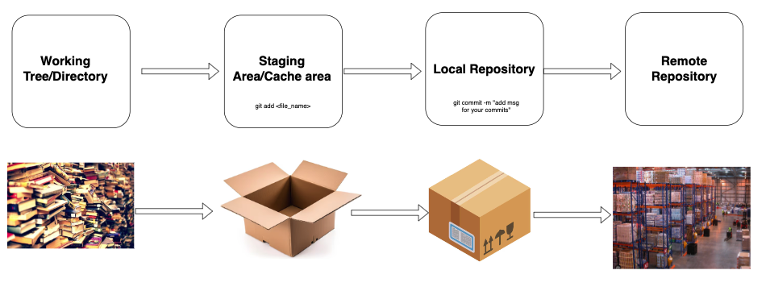
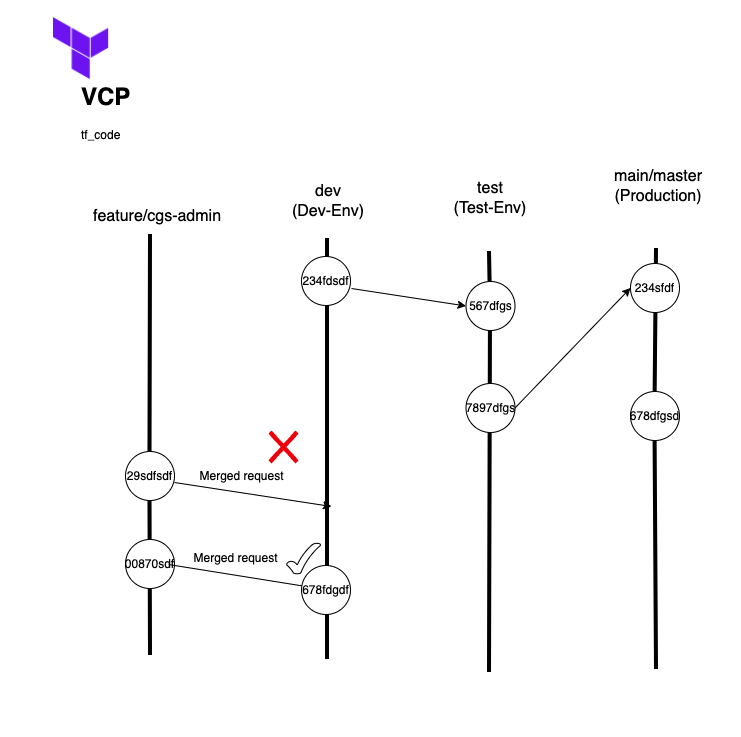

Git
---

### Required  Softwares to be installed on your system (Windows, Mac, Linux)

1. Git [Refer Here for Git Download](https://www.git-scm.com/downloads)
2. VS Code [Refer Here for VS Code Download](https://code.visualstudio.com/download)

### Git Official docs Refs

* [Refer Here for Official docs for git](https://www.atlassian.com/git/tutorials/what-is-version-control)

### Git Commands Refs

* [Refer Here for git commands](https://www.atlassian.com/git/tutorials/setting-up-a-repository)

### Git Area's 

1. Working Tree 
2. Staging Area 
3. Local Repository 
4. Remote Repository 

### Git Branching / workflow

* [Refer Here](https://www.atlassian.com/git/tutorials/comparing-workflows/gitflow-workflow) for official docs 

